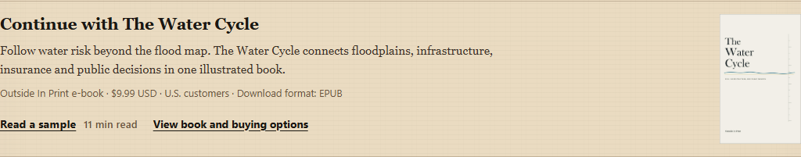
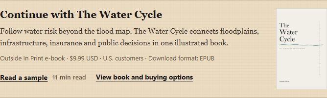
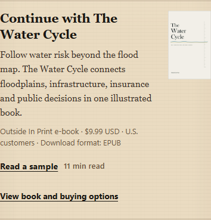

# Contextual Water Cycle cover review ~ October 7, 2026

Status: draft for owner review. The October 7 follow-up authorizes a small clickable cover in the two existing invitations. It explicitly holds merge and deployment for new publication approval; the completed Phase 1 release approval does not extend to this change.

The clean isolated branch starts at current main `577865875238221b86cc9fea7bc413db6fac707e`, preserving the concurrent Gallery changes. Only the contextual partial, scoped CSS, three focused tests, and this review evidence change. The previous Phase 1 release record remains intact.

## Result

The catalog's existing Water Cycle cover and alt text pass through `images/picture.html`. The original cream cover was visually inspected; it has black title text, blue-and-gold water lines, a vertical measurement rule and the imprint. Its source bytes remain unchanged. The image links natively to `/shop/the-water-cycle/`, with the accessible name `View The Water Cycle and buying options`. The full cover ratio is preserved at 104px wide on desktop and 72px on phone; the link exceeds the 44px tap-target minimum and retains visible keyboard focus.

The existing approved copy, sample and buying links, derived offer facts, source/file/route gating, reading order and checkout remain unchanged. The existing `internal_promo_click` handler receives only two new bounded slots: `collection_book_cover` and `article_book_cover`. There is no JavaScript change, additional storage, private field, internal UTM or form submission.

## Publication-record interpretation

This changes shared supplemental bookstore presentation, with no article-source, article-artwork or citation-record edit. The essay therefore remains v2.1 / Sixth with its original date and revision history unchanged. The policy has no explicit template-only exemption; this bounded interpretation follows the source scope of the revision SOP and the repository's shared UI practice. No new editorial review or article revision is claimed.

## Preview evidence

These are unedited screenshots from the single follow-up build, served locally with external endpoints intercepted. Full-page screenshots, focus states, 320px views and before/after comparisons against the preserved published Phase 1 build are retained in the execution workspace `cover-browser-evidence/`, including `preview-evidence.json`.

| Page | Desktop, 1280px viewport | Phone, 390px viewport |
| --- | --- | --- |
| Flood collection |  |  |
| 100-year-flood essay |  |  |

## Validation

Source-only bookstore sample and direct storefront checks, all ten collection reading-path contracts, browser syntax and `git diff --check` passed. Independent focused source review found no blocking issues. One analytics-enabled Hugo 0.164.0 render completed in 18.806 seconds using a copied warm cache.

The two focused browser tests passed at 1280x900, 390x844 and 320x720: catalog cover decoding/dimensions, full ratio, small size, right alignment, no overflow, keyboard focus, nested-image click, product destination, one event per activation across back/refresh/repeats, privacy, JavaScript-disabled links and owner opt-out. Screenshot review also covered both target pages at 1280/390/320 widths with loaded local images and fonts.

Required generated-output and CI results are recorded in the draft PR. No live purchase, Buttondown submission, main update or deployment is part of this review.
