# Six contextual book invitations ~ draft review, October 7, 2026

**Draft only. No merge, auto-merge, deployment or publication is authorized for this batch.** The owner requested the focused plan followed by implementation; a separate publication approval remains pending. The PR records its exact head and required CI outcome.

The clean worktree starts at current main `4b64383ff5e3e4932ac88f8918adfa7f43b2655d` (merged Water Cycle cover PR #150). This adds one collection invitation and one reading-page invitation for each of 2045, The American Nightmare, and The Parable of the Sheep. The existing two Water Cycle invitations remain intact, giving exactly eight explicitly permitted sources.

## Behavior and scope

Each invitation uses the approved heading and connection, the existing sample helper, “View book and buying options,” and the existing small clickable cover on the right. The catalog supplies price, format, geography, cover and alternative text. Prices remain $19.99 for 2045 and $9.99 for the other books, in USD for U.S. direct customers; these facts are not copied into front matter. Kindle and checkout behavior are unchanged.

The partial binds each source file and canonical route to its assigned book. Raw YAML front matter owns the opt-in; inherited parameters, cascade, membership and global defaults cannot create modules. A supported book substituted on the wrong source fails validation. Exact published target, catalog key, live EPUB SKU and sample ownership validate before helper defaults. The three bundled samples retain their ready/non-draft requirement. 2045 alone keeps its exact published standalone story at `/shop/2045/sample/`, including the existing complete-story label and calculated reading time.

The shared template calls and CSS are unchanged. Invitations follow Start Here where that section already exists, and precede collection contents. Syd and Oliver has no Start Here section: its invitation follows the complete existing collection header. Reading-page invitations follow the collection continuation and precede Publication record, including Infrastructure at its canonical `/syd-and-oliver/infrastructure/` route.

The existing six `article_book_*` / `collection_book_*` slots distinguish sample, detail and cover actions. Existing event types, sanitization and consent remain; book slug and canonical path identify the book. The 2045 sample event uses its standalone path. No tracking script, storage, UTM, identifier, marketing, checkout, product/sample content, asset, price or schedule changes are included. PR #135 remains outside this work.

## Publication records

| Reading page | Proposed edition | Original date preserved |
| --- | --- | --- |
| The New Meta Economy | 2.0 / Fourth → 2.1 / Fifth | Yes |
| America’s Century of Humiliation | 1.3 / Third → 1.4 / Fourth | Yes |
| Infrastructure | 1.0 / First → 1.1 / Second | Yes, including 16:15:18 UTC |

Each page gains one minor revision entry, with all prior history and body content preserved. The two essay audits prepend bounded supplemental-invitation evidence and all seven philosophy rows; no fresh whole-article review is claimed. Infrastructure retains its dialogue exemption and records the bounded change in its existing package. The Syd collection’s UTF-8 BOM is removed so its source declaration satisfies the existing strict front-matter parser; its other bytes are preserved apart from the opt-in.

The draft entries use October 7. Infrastructure uses the actual preparation observation `2026-10-07T22:28:55Z`, after its same-day original publication. **Before any later approved publication, reconcile these proposed revision dates with the actual release day, without advancing a second unpublished edition.**

## Visual evidence

The three original covers were inspected and reused byte-for-byte: 2045’s black scanline-eye design via managed derivatives, American Nightmare’s black/ivory title and red line, and Parable’s flock beneath a stormy sky. Cover width stays 104px on desktop and 72px on phone, with full aspect ratio, catalog alt text and visible keyboard focus. No CSS adjustment was needed.

These unedited module screenshots come from the successful local production render with all requests served locally. Full viewport and focus screenshots, plus both preserved Water Cycle entries, are retained in the execution workspace.

| Placement | Desktop, 1280px | Phone, 390px |
| --- | --- | --- |
| Technology, AI, and the Machine Future | 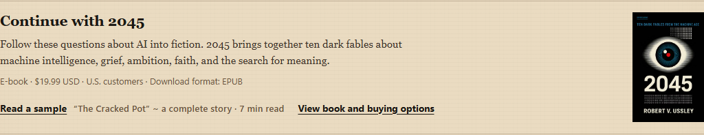 | 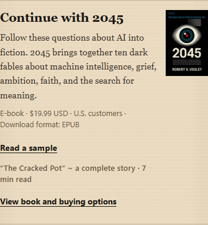 |
| The New Meta Economy | 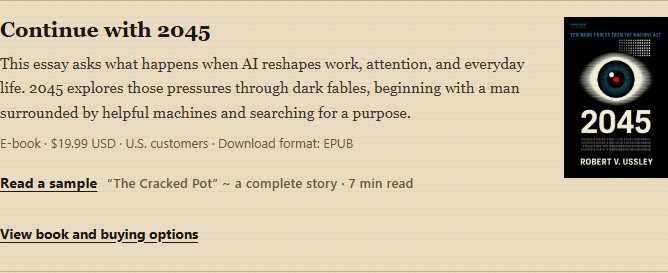 | 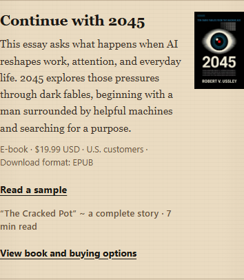 |
| Household Economy, Work, and Cost | 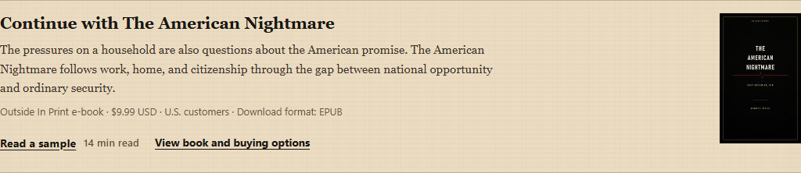 | 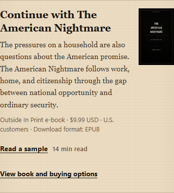 |
| 1929–2029: America’s Century of Humiliation | 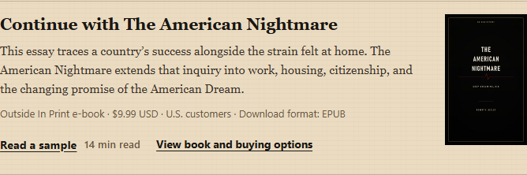 | 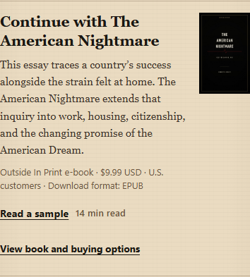 |
| Syd and Oliver Dialogues | 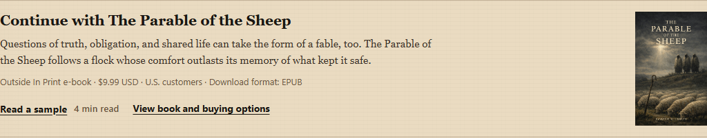 | 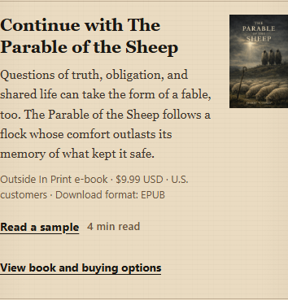 |
| Infrastructure | 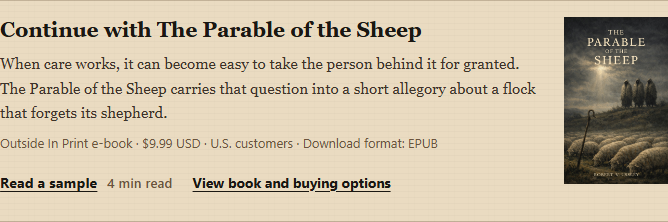 | 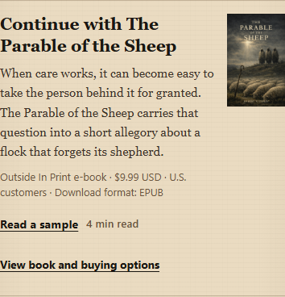 |

## Validation evidence

- Pinned repository wrappers validated PowerShell 7.5.0, Hugo Extended 0.164.0 and Node 20.20.2, reusing existing local runtimes and warm image cache. No local npm/npx gate was used.
- Source-only sample/direct storefront contracts, ten collection reading-path tests, syntax and whitespace checks passed. Thirty-three tiny Hugo fixtures cover exact eight-page bindings, invalid/missing catalog/SKU/sample cases, cross-book substitutions, inherited opt-ins, unpublished targets and 2045’s standalone sample.
- Scoped essay guardrails with `RequireEditorialPhilosophyAudit` passed. The New Meta Economy retains an existing nonblocking caption-residue warning; its caption is unchanged. Infrastructure correctly follows the dialogue exemption.
- The first render stopped on a same-day revision chronology error (17.799 seconds): a date-only revision preceded Infrastructure’s original afternoon publication. The draft timestamp correction preserved the original date and sole edition increment. The corrected render passed in 9.410 seconds; all subsequent output/visual checks reuse that build. No further production render was needed.
- Build manifest, route smoke, fresh public HTML, responsive image output and direct storefront checks passed. The bookstore output and browser reading-order assertions were corrected to reflect Syd’s existing lack of a Start Here section; no production layout changed.
- Sixteen desktop/phone module previews (eight entries at two widths) passed full-ratio, right-placement, focus and no-overflow assertions and were captured. The twelve new-entry screenshots above were visually reviewed. Both focused browser checks passed: native navigation across all eight entries at 1280/390/320 in 94.388 seconds, plus JavaScript-disabled links and owner opt-out in 6.018 seconds. They cover sample/detail/cover navigation, keyboard and nested-image activation, back/refresh/repeats, exact single events and private-field exclusion. All endpoints are mocked; no live form or purchase is submitted.
- Both Water Cycle module HTML fragments are byte-identical to the validated PR #150 output. All four product pages and 2045’s sample HTML are identical after normalizing only the differing local analytics `allowLocal` build flag. Catalog, product/sample sources and all three cover bytes are unchanged.
- Independent focused review found no blocking issues in source bindings, validation, preservation, bounded audits or tests. Required CI results and the exact reviewed head are recorded in the draft PR.

This evidence covers navigation and presentation. It does not establish purchase conversion or paid fulfillment. Publication remains held.
